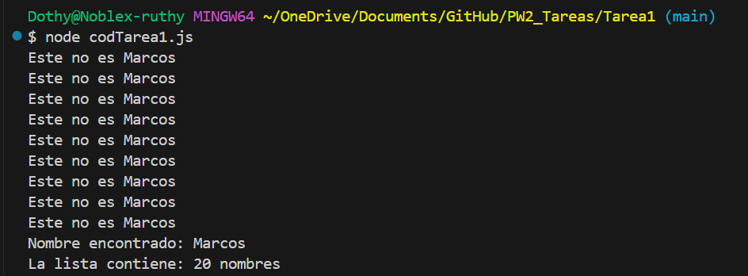

Programacion Web 2 - Ruth Gomez

## 📜 Tarea Node 1

Realizar un ejercicio donde exista:

- Una variable que contenga 20 nombres
- Una variable que contenga "Marcos"
- Una variable local de la función que contenga el numero de elementos de la variable con los nombres
- Crear una función donde reciba como parámetro los nombres (la variable)  y el nombre a buscar
- Usar while (dentro de la función) para recorrer los nombres, si lo encuentra (tercera posición: ej Marcos) frenar ejecución de while e imprimir el nombre. 
- si no es el nombre buscado imprimir por consola "este no es " + variable con "Marcos"
- si no es el nombre buscado imprimir por consola "nombre encontrado: " + nombre
- Imprimir por consola "la lista contiene: " + variable_local
*La corrección se hace en clase.*

## 🖥️ Ejecución

